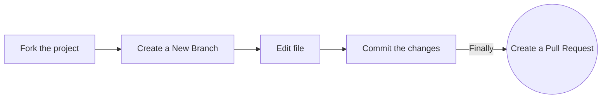

<h1 align="center">Open-source-practice Pull Requests</h1>

<div align="center">
<!-- ALL-CONTRIBUTORS-BADGE:START - Do not remove or modify this section --> 
 
[](#contributors-)
<a href="https://github.com/recodehive/recode-website/stargazers"></a>
<a href="https://github.com/recodehive/recode-website/network/members"></a> 
<a href="https://github.com/recodehive/recode-website/pulls"></a>
<a href="https://github.com/recodehive/recode-website/issues"></a>
<a href="https://github.com/recodehive/recode-website/graphs/contributors"></a>
<a href="https://github.com/recodehive/recode-website/LICENSE"></a>
[](https://visitcount.itsvg.in)
<!-- ALL-CONTRIBUTORS-BADGE:END -->
This is the all in one place for documentation help regarding How to contribute.
</div>


##

Now, resolve your all doubts and communicate with our all contributors.

[](https://discord.gg/Yxv9RA3r) [](https://www.linkedin.com/in/sanjay-k-v/)


## Getting Started

To get started with contributing to Recode-Hive, please refer to our [Contributing Guidelines](CONTRIBUTING.md).

Follow these steps:




1. **Clone the repository:** 
   ```bash
   git clone https://github.com/your-username/recodehive-website.git
   ```

2. **Navigate to the project directory:**
   ```bash
   cd recodehive-website
   ```

3. **Install dependencies:**
   ```bash
   npm install
   ```

4. **Running the Application:**

    Once you have installed the dependencies, you can run the application locally using:
    ```bash
    npm i
    ```
    ```bash
    npm start
    ```

    This command will start a development server and open the application in your default web browser.

**If you'd like to contribute to CodeHarborHub, please follow these guidelines:**

- **Fork** the repository and clone it locally.
- Create a new branch for your feature or bug fix: `git checkout -b feature-name`
- Make your changes and test thoroughly.
- Commit your changes: `git commit -m "Brief description of your changes"`
- Push to the branch: `git push origin feature-name`
- Submit a pull request detailing your changes.


## License

This project is licensed under the [MIT License](LICENSE).

## Badges

[](https://app.deepsource.com/gh/CodeHarborHub/codeharborhub.github.io/) [](https://app.deepsource.com/gh/CodeHarborHub/codeharborhub.github.io/) [](https://deepscan.io/dashboard#view=project&tid=24046&pid=27285&bid=870905) [](https://github.com/CodeHarborHub/codeharborhub/actions/workflows/docker-image.yml) [](https://github.com/CodeHarborHub/codeharborhub/actions/workflows/close-old-issue.yml) [](https://github.com/CodeHarborHub/codeharborhub/actions/workflows/close-old-pr.yml) [](https://github.com/CodeHarborHub/codeharborhub/actions/workflows/github-code-scanning/codeql) [](https://github.com/CodeHarborHub/codeharborhub/actions/workflows/autocomment-iss-close.yml) [](https://github.com/CodeHarborHub/codeharborhub/actions/workflows/greetings.yml)                 

## Contributors


<div align="center">

Happy open-source contributions and here’s to your career success! 🎉
<br>
### recode-hive 2025

[Website](https://recodehive.com/) | [Instagram](https://www.instagram.com/nomad_brains/) | [LinkedIn](https://www.linkedin.com/in/sanjay-k-v/) | [Twitter](https://x.com/sanjay_kv_) | [YouTube](https://www.youtube.com/@RecodeHive)<br>
**🔔 Don’t miss a beat!** <br>
  Subscribe to receive our newsletter directly in your inbox for the latest career insights & tailored to your journey.<br>
[](https://recodehive.substack.com/) <br>

</div>


