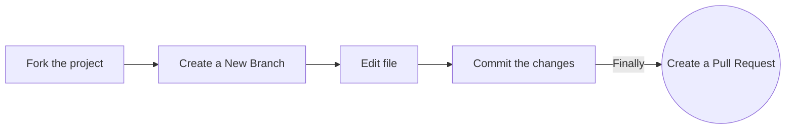

<h1 align="center">Open-source-practice Pull Requests</h1>

<div align="center">
<!-- ALL-CONTRIBUTORS-BADGE:START - Do not remove or modify this section --> 
 
[](#contributors-)
<a href="https://github.com/recodehive/Opensource-practice/stargazers"></a>
<a href="https://github.com/recodehive/Opensource-practice/network/members"></a> 
<a href="https://github.com/recodehive/Opensource-practice/pulls"></a>
<a href="https://github.com/recodehive/Opensource-practice/issues"></a>
<a href="https://github.com/recodehive/Opensource-practice/graphs/contributors"></a>
<a href="https://github.com/recodehive/Opensource-practice/blob/master/LICENSE"></a>
[](https://visitcount.itsvg.in)
<!-- ALL-CONTRIBUTORS-BADGE:END -->
This is the all in one place for documentation help regarding the postman challenge.
</div>

Repository for you to raise a Pull Request to **practice** open-source ! 🎉

Learn GithHub from Scratch here: https://recodehive.com/github-tutorials/

### Add your name to the alphabetical list and, optionally, a link to your GitHub account (in alphabetical order below your letter too)

### Option 1. Complete this process in GitHub (in your browser)


dd
**1. Fork the project:**

- Click the gray <kbd>Fork</kbd> button at the top right of the previous page. This creates your copy of the project and saves it as a new repository in your GitHub account.


# Website

This website is built using [Docusaurus](https://docusaurus.io/), a modern static website generator.

### Installation

```
$ yarn
```

### Local Development

```
$ yarn start
```

This command starts a local development server and opens up a browser window. Most changes are reflected live without having to restart the server.

### Build

```
$ yarn build
```

This command generates static content into the `build` directory and can be served using any static contents hosting service.

### Deployment

Using SSH:

```
$ USE_SSH=true yarn deploy
```

Not using SSH:

```
$ GIT_USER=<Your GitHub username> yarn deploy
```

If you are using GitHub pages for hosting, this command is a convenient way to build the website and push to the `gh-pages` branch.
