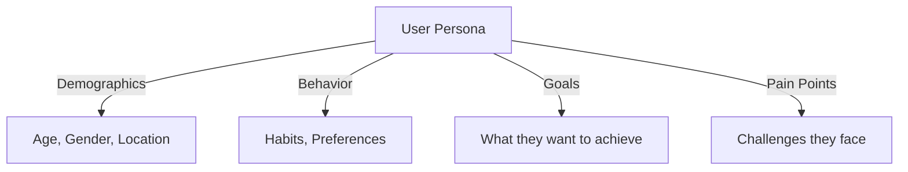
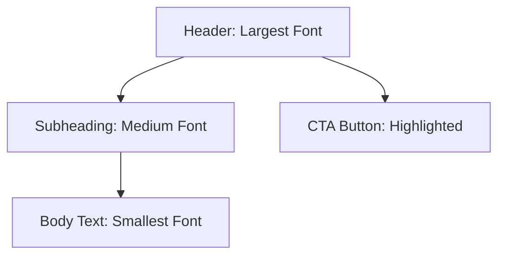
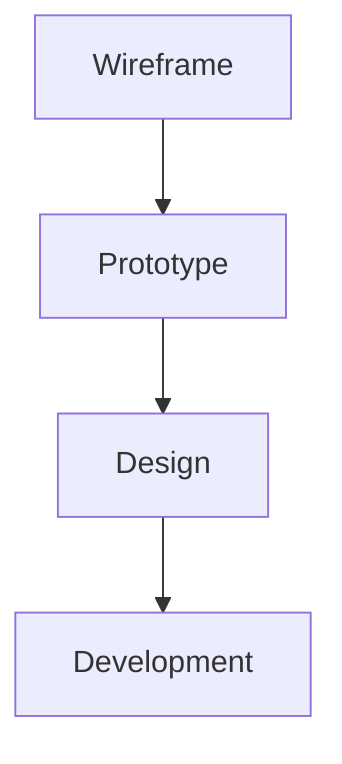
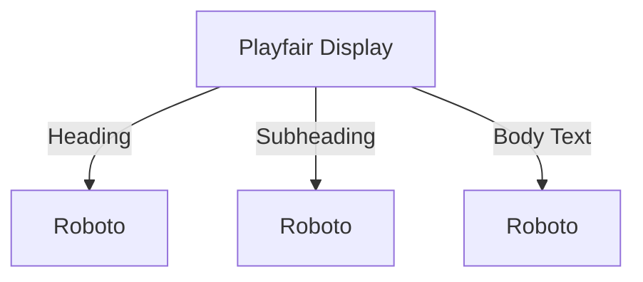
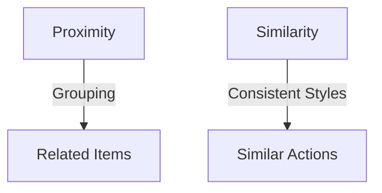

Web design is all about creating intuitive, delightful, and meaningful user experiences. In this guide, we'll dive into the key principles, easy-to-understand concepts, and practical steps to help you build user-friendly and visually stunning designs.

<!-- truncate -->

## Why UI/UX Matters?
UI (User Interface) is how something looks, and UX (User Experience) is how it works. When combined, they create designs that:
- Solve problems.
- Are easy to use.
- Keep users engaged.

## Core Principles of UI/UX Design

### 1. Focus on the User
Always design with your audience in mind. Ask yourself:
- Who are the users?
- What are their goals?
- How can you make their experience seamless?

:::tip
Create user personas and map their journeys for better understanding.
:::

### 2. Consistency is Key
Use similar elements throughout your design to avoid confusion. For example:
- Stick to a specific button style.
- Use the same font for headings and body text.

### 3. Visual Hierarchy
Guide your users by organizing elements logically:
- Use larger fonts for headings.
- Highlight call-to-action buttons with bright colors.

### 4. Keep it Simple
Avoid clutter and distractions. Every element should have a purpose.
- Use whitespace to give your design breathing room.
- Limit choices to reduce decision fatigue.

## Layouts Made Easy

### What is a Layout?
A layout organizes content visually. Common sections include:
- **Header**: Logo, navigation.
- **Main Area**: Primary content.
- **Footer**: Links, contact info.

### Using Grid Systems
Grids help align elements perfectly. Most designers use a 12-column grid for flexibility.

<!--  -->

### From Wireframe to Prototype
Design starts with simple sketches (wireframes) and evolves into interactive prototypes:
1. **Wireframe**: Basic layout.
2. **Prototype**: Add colors, images, and interactivity.

<!--  -->

## Colors in Web Design

### **How Colors Affect Users**
- **Blue**: Trust and calmness.
- **Red**: Energy and urgency.
- **Green**: Nature and health.

<!--  -->

### Creating a Color Palette
Use tools like [Coolors](https://coolors.co) to generate harmonized palettes.

## Typography Basics

### Font Pairing Made Simple
Combine a decorative font with a readable one:
- **Example**: Playfair Display (fancy) + Roboto (clean).

<!--  -->

### Readable Text Sizes
- **Titles**: 24-32px.
- **Body Text**: 16px.
- **Buttons**: 14-18px.

## Practical Design Tips

### 1. Use Fitts's Law
Make buttons large and easy to click, especially on mobile.

### 2. Apply Gestalt Principles
- **Proximity**: Group related items together.
- **Similarity**: Use consistent styles for similar actions.

<!--  -->

### 3. Optimize for Accessibility
- Ensure text has enough contrast against its background.
- Add alt text to images for screen readers.

## Conclusion
UI/UX design is about creating meaningful interactions and beautiful designs that cater to users. With these principles and practices, you're well on your way to crafting exceptional web experiences. Remember, the secret is empathy and constant iteration.