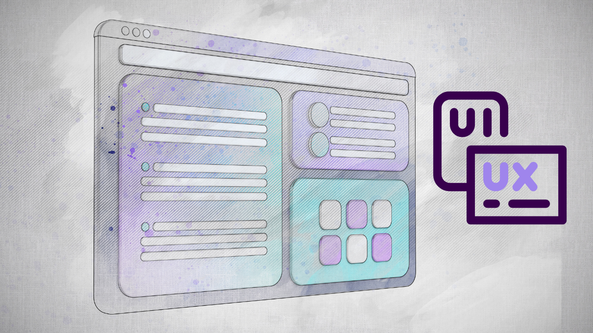

User experience design can be overwhelming because of the number of factors that influence what a product should look like and how it should function.

But you don’t need to know everything about a user before you start designing — the UX process is designed to solve problems and make a customer’s life easier. You can start by breaking down the development of a product into seven steps:

### 👤 Research the User  

When you’re designing a new product, it’s important to remember to research your user. This means gathering data about who will be using the product and their needs. Who are they? What do they need? What are their habits and preferences? What are their goals? What are their pain points? What are they looking for in a product? Only by understanding the user can you create a product that meets their needs and exceeds their expectations. If you design a product without understanding the user, it is likely to be unsuccessful.

Gather data about who will be using the product and their needs.

- ❓Who are they?  
- ❓What are their goals, habits, and pain points?  
- ❓What are they looking for in a product?

To answer these questions, you need to do some research. This involves gathering data about who will be using the product and their needs. You can find this data from surveys, focus groups, interviews, and other forms of market research. Once you have this data, you can start to design a product that meets the needs of your users.

### 🧩 Define the Problem  

One of the most important aspects of good design is understanding the problem that needs to be solved. Too often, people focus on the solution without taking the time to understand the problem. This can lead to misguided efforts and a lot of wasted time and energy. The best way to identify the problem is to ask a lot of questions. Try to get as much information as possible from stakeholders, users, and anyone else who might have a vested interest in the project. Once you have a good understanding of the problem, you can start looking for solutions.

### 💡 Ideate Solutions  
Generate creative ideas to solve the problem. The first step in coming up with ideas is to understand the problem fully. What are its causes and effects? What are people currently doing to try to solve it? Once you have a good understanding of the problem, you can start brainstorming potential solutions. To generate creative ideas, it can be helpful to think about things from different angles. Try approaching the problem from different perspectives, using different methods or tools, or looking at it from a different time period. Sometimes all it takes is a fresh perspective to come up with a great solution.

- ✅Think outside the box  
- ✅Use different methods and perspectives  
- ✅Brainstorm with your team or solo  

Approach problems from multiple angles. Innovation often comes from seeing something in a new light.

### 🛠️ Refine the Solution  
Select the best idea and make it more specific.

The best way to improve a solution is to select the best idea and make it more specific. This will help to focus the team on the most important aspects of the problem. This can be done in a number of ways, but the most effective is to break the idea down into smaller chunks that can be easily addressed. Once the smaller chunks have been defined, it becomes easier to see how they fit together and whether or not they are feasible. Making a solution more specific has several benefits. It can help to focus the team on what needs to be done and make sure that everyone is on the same page.

- ✅Focus on high-impact features  
- ✅Define clear goals  
- ✅Ensure everyone is aligned  

Refining makes execution manageable and ensures the solution directly addresses the user problem.There are different types of prototypes that you can use, depending on what you want to test with users. These include low-fidelity prototypes, which are sketches or wireframes of the product; high-fidelity prototypes, which are more realistic versions of the product; and paper prototypes, which are sketches.

### 🧪 Develop Prototypes  
Create a basic version of the solution to test with users. Prototyping is the process of creating a basic or preliminary version of a product or service to test with users. The goal of prototyping is to get feedback from potential users early in the design process so that you can make changes and improvements before you invest too much time and money in the final product. You can use prototypes for different types of products, such as websites, apps, and software.

### Types of Prototypes:
- ✅**Low-fidelity:** Sketches, wireframes  
- ✅**High-fidelity:** Interactive, realistic simulations  
- ✅**Paper prototypes:** Simple, hand-drawn flows  

Prototypes help gather feedback early and avoid costly mistakes later in development.

### 📣 Collect Feedback from Users  

Feedback is a crucial part of the design process. We need to collect feedback from users to make sure that the prototype solves their needs. This will help us design a better product. The feedback we collect can be qualitative or quantitative, but it is most often qualitative because it is easier to get responses; can be collected in many different ways, such as through surveys and interviews.
Test your prototype with real users to understand: 

- ✅Does it solve their needs?  
- ✅Is the experience smooth and intuitive?

Gather both **qualitative** and **quantitative** feedback through interviews, usability testing, and surveys. Use that data to iterate and improve. 🔁

### 🚀 Launch the Product  

Launching a product is a tough task. Especially when it comes to public release. You have to make sure that you are ready for any feedback and criticism you might receive.
When launching your product, there are many factors that need to be taken into accounts such as feedback, the market, and the competition. There are many things that can go wrong when releasing your product publicly. However, with careful planning and taking all of these factors into account, a successful launch is possible.

Incorporate feedback, finalize features, and release your product to the public.

- ✅Prepare for feedback and iteration  
- ✅Know your market and competitors  
- ✅Stay user-focused even after launch  

A successful launch comes from ongoing improvement and close attention to your users’ evolving needs. Whether you’re a sole UX designer, part of a team, or working for a large organization, these are certain steps that you need to follow in order to achieve your goals effectively. The seven steps listed above are not easy. They take time, effort, and a strong aptitude for problem-solving. Yet, Executing the above steps correctly will maximize your chances of success, while failing to address key steps along the way could sink your whole project, with the right mentors, direction, and guidance, they can help aspiring UX designers reach their goals almost as fast as they set them.

### 🧘‍♀️ Takeaway: Build with Users, Not Just for Them

Whether you're a solo UX designer or working in a large team, these 7 steps are crucial. They require time, effort, and problem-solving skills—but skipping any of them can cost you the success of your product.

With strong mentorship and direction, aspiring UX designers can move faster and more confidently in their careers.

## ✅ Final Verdict

If you’ve made it this far—thank you! 🙌  
I hope this guide helped you better understand how to **streamline your UX design process**.  
If you found value in it, please share it with your fellow designers and friends.

📩 Contact: **sowmiyavenkatesan611@gmail.com** f

Happy Designing! 🎨
<GiscusComments/>