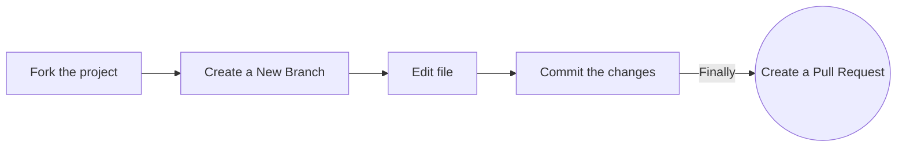

Thank you for considering contributing to CodeHarborHub! We welcome contributions from everyone. Whether you're a seasoned developer or just starting out, there are many ways to get involved and help improve CodeHarborHub. This document outlines the guidelines for contributing to this project.

## Getting Started

To get started with contributing to Recode-Hive, please refer to our [Contributing Guidelines](CONTRIBUTING.md).

Follow these steps:




1. **Clone the repository:** 
   ```bash
   git clone https://github.com/your-username/recodehive-website.git
   ```

2. **Navigate to the project directory:**
   ```bash
   cd recodehive-website
   ```

3. **Install dependencies:**
   ```bash
   npm install
   ```

4. **Running the Application:**

    Once you have installed the dependencies, you can run the application locally using:
    ```bash
    npm i
    ```
    ```bash
    npm start
    ```

    This command will start a development server and open the application in your default web browser.

**If you'd like to contribute to CodeHarborHub, please follow these guidelines:**

- **Fork** the repository and clone it locally.
- Create a new branch for your feature or bug fix: `git checkout -b feature-name`
- Make your changes and test thoroughly.
- Commit your changes: `git commit -m "Brief description of your changes"`
- Push to the branch: `git push origin feature-name`
- Submit a pull request detailing your changes.


## License

This project is licensed under the [MIT License](LICENSE).