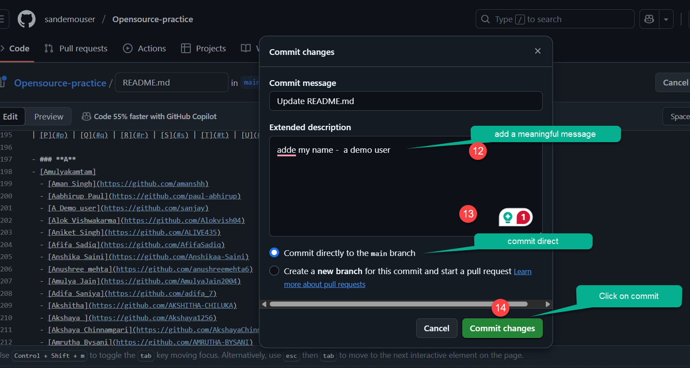

HTML Attributes and Values are used to provide additional information about HTML elements

<AdsComponent />

## HTML Attributes

HTML attributes are used to provide additional information about HTML elements. 
Here is an example of an HTML element with attributes:

Go to this repository https://github.com/sanjay-kv/Open-source-Practice
```html title="fork the repository"
https://github.com/sanjay-kv/Open-source-Practice
```

    <BrowserWindow url="https://github.com/sanjay-kv/Open-source-Practice" bodyStyle={{padding: 0}}>    
     [](https://github.com/sanjay-kv/Open-source-Practice)
    </BrowserWindow>


In this example, the `<a>` element is an 

## HTML Attribute Values

HTML attribute values define specific settings or properties for attributes. They are assigned to attributes using the `=` sign and enclosed in quotes (`"` or `'`). The value of an attribute can be a string, number, URL, color, or other data types depending on the attribute.

Here is an example of an HTML element with attribute values:


    <BrowserWindow url="https://github.com/sanjay-kv/Learn-GitHub/fork" bodyStyle={{padding: 0}}>    
     [](https://github.com/sanjay-kv/Learn-GitHub/fork)
    </BrowserWindow>


In this example, the ``

:::tip
### Best Practices for Using HTML Attributes and Values

- Use attributes to provide additional information about elements and improve accessibility.
- Use attribute values that are relevant and descriptive to enhance the user experience.


By following these best practices, 
:::


    <BrowserWindow url="https://github.com/sandemouser/Learn-GitHub" bodyStyle={{padding: 0}}>    
     [](https://github.com/sandemouser/Learn-GitHub)
    </BrowserWindow>


    <BrowserWindow url="https://github.com/sandemouser/Learn-GitHub" bodyStyle={{padding: 0}}>    
     [](https://github.com/sandemouser/Learn-GitHub)
    </BrowserWindow>


## Will follow without using command line and direct edit on the page. 


    <BrowserWindow url="https://github.com/sandemouser/Learn-GitHub" bodyStyle={{padding: 0}}>    
     [](https://github.com/sandemouser/Learn-GitHub)
    </BrowserWindow>


    <BrowserWindow url="https://github.com/sandemouser/Learn-GitHub" bodyStyle={{padding: 0}}>    
     [](https://github.com/sandemouser/Learn-GitHub)
    </BrowserWindow>

```html title="fork the repository"
  - [A Demo user](https://github.com/sanjay)
```

    <BrowserWindow url="https://github.com/sandemouser/Learn-GitHub" bodyStyle={{padding: 0}}>    
     [](https://github.com/sandemouser/Learn-GitHub)
    </BrowserWindow>

Let's consider an e
By using attributes and values effectively, you can create engaging and informative web pages that provide a rich user experience.


    <BrowserWindow url="https://github.com/sandemouser/Learn-GitHub" bodyStyle={{padding: 0}}>    
     [](https://github.com/sandemouser/Learn-GitHub)
    </BrowserWindow>


    <BrowserWindow url="https://github.com/sandemouser/Learn-GitHub" bodyStyle={{padding: 0}}>    
     [](https://github.com/sandemouser/Learn-GitHub)
    </BrowserWindow>


    <BrowserWindow url="https://github.com/sandemouser/Learn-GitHub" bodyStyle={{padding: 0}}>    
     [](https://github.com/sandemouser/Learn-GitHub)
    </BrowserWindow>

## Watch this video
<iframe width="883" height="480" src="https://www.youtube.com/embed/R7NReLBCT_8?list=PLrLTYhoDFx-kiuFiGQqVpYYZ56pIhUW63" title="How to do your first opensource on  GitHub" frameborder="0" allow="accelerometer; autoplay; clipboard-write; encrypted-media; gyroscope; picture-in-picture; web-share" referrerpolicy="strict-origin-when-cross-origin" allowfullscreen></iframe>


## Conclusion

HTML attributes and values play a crucial role in web development 