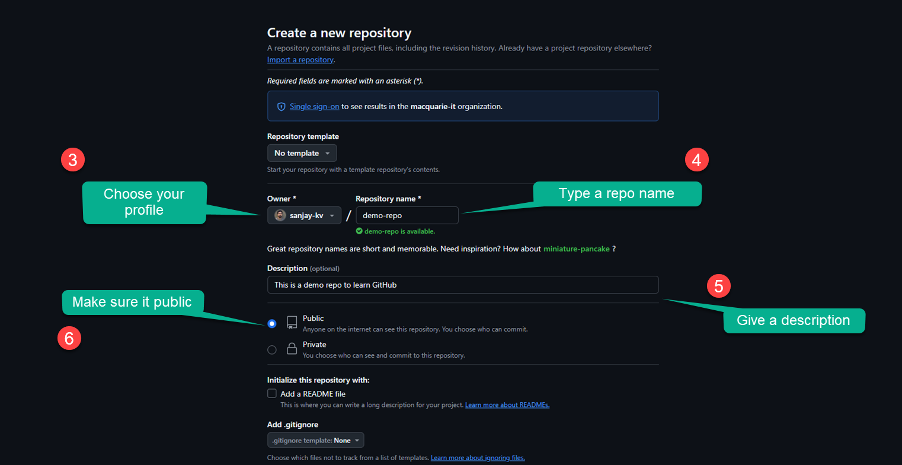
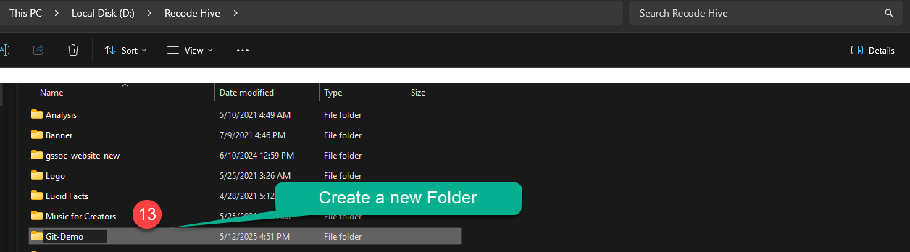

HTML (Hypertext Markup Language) is the standard markup language for creating web pages. It provides the structure and layout of the content on the web. In this tutorial, you will learn about the syntax and structure of HTML.

< />

## Prerequisites

You should have a Github account 2. Should have a basic understanding of how Git works/ and Git running in your OS.


### How to create Github Repository

Step 1: Go to Git hub and create a new Repository.

    <BrowserWindow url="https://github.com" bodyStyle={{padding: 0}}>    
     [](https://github.com/sanjay-kv)
    </BrowserWindow>
<br />

Step 2: Specify the Name of the Project, make It public or primate, check on the readme file. Then click on Create repository on the button below.


    <BrowserWindow url="https://github.com/new" bodyStyle={{padding: 0}}>    
     [](https://github.com/sanjay-kv)
    </BrowserWindow>
Upon creation you will get a screen like this below, the explanation of each elements is mentioned below. 
 
  ```html title="create a new repository on the command line"
echo "# demo-repo" >> README.md
git init
git add README.md
git commit -m "first commit"
git branch -M main
git remote add origin https://github.com/sanjay-kv/demo-repo.git
git push -u origin main
    ```
    <BrowserWindow url="https://github.com/sanjay-kv/demo-repo" bodyStyle={{padding: 0}}>    
     [](https://github.com/sanjay-kv)
    </BrowserWindow>

- **`<!DOCTYPE html>`**: Declares the document type and version of HTML.
- **`<html>`**: Root element that contains all other elements.
- **`<head>`**: Contains metadata about the document. It includes elements like `<meta>` and `<title>`.
- **`<meta charset="UTF-8" />`**: Specifies the character encoding of the document.
- **`<meta name="viewport" content="width=device-width, initial-scale=1.0" />`**: Sets the viewport properties for responsive design.
- **`<title>`**: Sets the title of the document (displayed in the browser tab).
- **`<body>`**: Contains the visible content of the document.
- **`<!-- Your content goes here -->`**: Represents a comment that is not displayed in the browser.


< />


### Browser Rendering

    <BrowserWindow url="https://github.com/sanjay-kv/demo-repo" bodyStyle={{padding: 0}}>    
     [](https://github.com/sanjay-kv)
    </BrowserWindow>


When the above HTML code is rendered in a browser, it will display the following content:


    <BrowserWindow url="https://github.com/sanjay-kv/demo-repo" bodyStyle={{padding: 0}}>    
     [](https://github.com/sanjay-kv)
    </BrowserWindow>

When the above HTML code is rendered in a browser, it will display the following content:


    <BrowserWindow url="https://github.com/sanjay-kv/demo-repo" bodyStyle={{padding: 0}}>    
     [](https://github.com/sanjay-kv)
    </BrowserWindow>

Now you can see the new file been added in your local system

When the above HTML code is rendered in a browser, it will display the following content:


    <BrowserWindow url="https://github.com/sanjay-kv/demo-repo" bodyStyle={{padding: 0}}>    
     [](https://github.com/sanjay-kv)
    </BrowserWindow>


When the above HTML code is rendered in a browser, it will display the following content:
How to push Github Repository?
Step 10:  Once the work is done click on save and open cmd/ terminal

    <BrowserWindow url="https://github.com/sanjay-kv/demo-repo" bodyStyle={{padding: 0}}>    
     [](https://github.com/sanjay-kv)
    </BrowserWindow>

Step 11: Initially when I was creating the repo I used Git add * to add all files in one go.

If you are committing for the first time adding a file in this way you may ask to enter your GitHub email id and username to proceed. The screenshot will be the same as below. and then while you enter the push command it will ask you browser prompt to sign in to Github.

  ```html title="create a new repository on the command line"
git config --global user.email "Enter your github Email"
git config --global user.name "Github username"
    ```

### Watch the video Tutorial


<iframe width="880" height="480" src="https://www.youtube.com/embed/DO38CZcw5pg?list=PLrLTYhoDFx-kiuFiGQqVpYYZ56pIhUW63" title="Github create repo using command line" frameborder="0" allow="accelerometer; autoplay; clipboard-write; encrypted-media; gyroscope; picture-in-picture; web-share" referrerpolicy="strict-origin-when-cross-origin" allowfullscreen></iframe>

## Conclusion

In this tutorial, you learned about the syntax and structure of HTML. HTML syntax consists of elements, tags, and attributes that define the structure and content of a web page. An HTML document follows a basic structure with elements like `<!DOCTYPE html>`, `<html>`, `<head>`, `<title>`, `<meta>`, and `<body>`. Understanding HTML syntax and structure is essential for creating web pages and applications.
