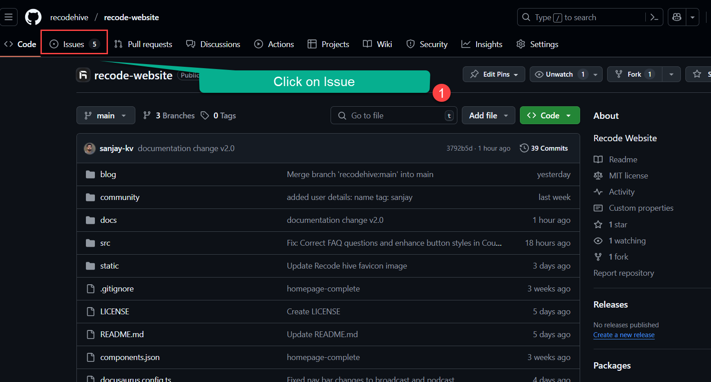
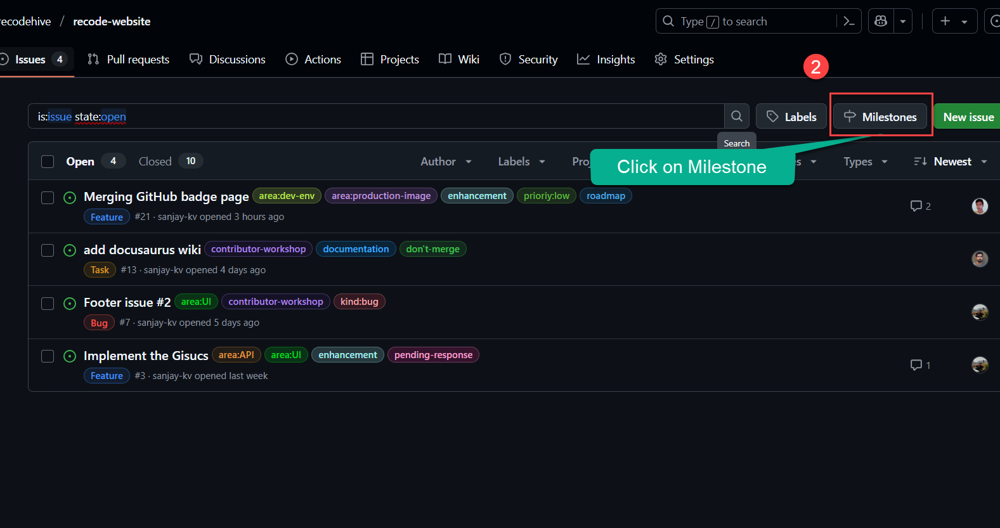
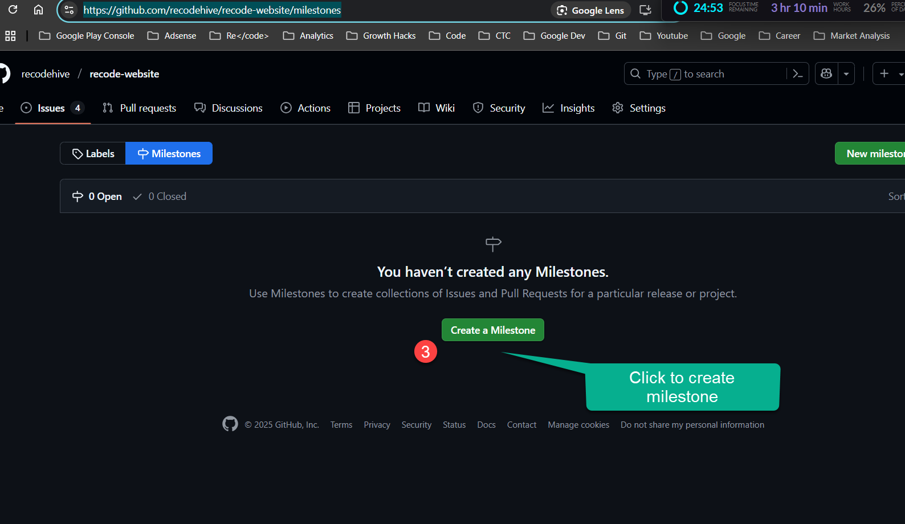
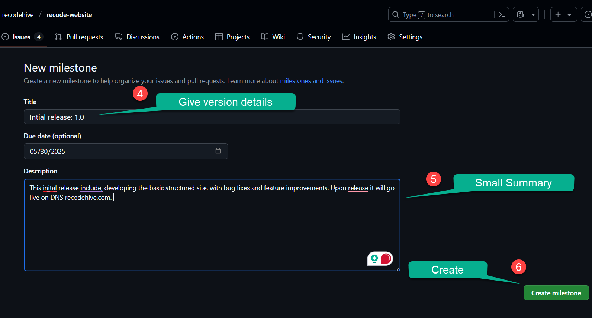
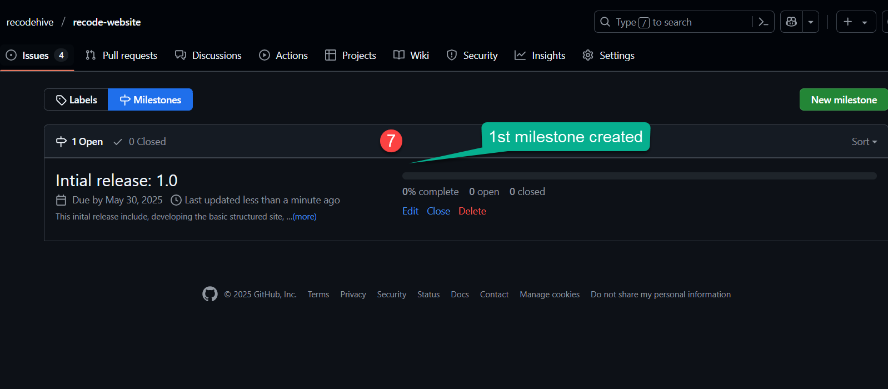
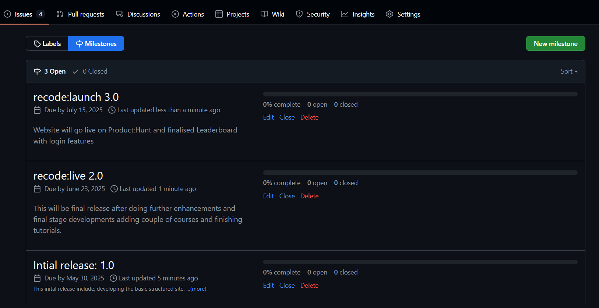
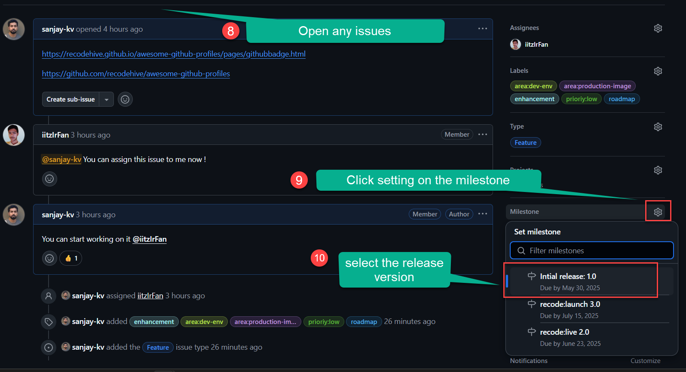
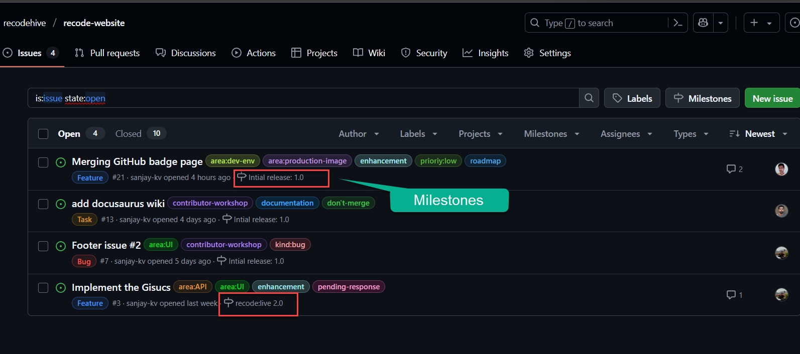

In the previous post we spoke about commit, fork, clone, in this post we gonna deep dive into the terminology by creating a GitHub Repository from the Scratch. 
Inorder to create a project and host, the repository is a place where you add all your program code files and other documentation. 
< />

### Prerequisites

- 1. You should have a Github account 
- 2. Should have a basic understanding of how Git works/ and Git running in your OS.

### How to create Github Repository

**Step 1:** Go to GitHub page, by default you will be in the Home page as shown below, Step 1 requires you to click on the ``+`` Icon and from the drop down click on the ``New Repository``.

    <BrowserWindow url="https://github.com/recodehive/recode-website" bodyStyle={{padding: 0}}>    
     [](https://github.com/recodehive/recode-website)
    </BrowserWindow>
**Step 2:** Specify the name of the Project, make It public or private, for this tutorial you will make it public, Once the repository is gone private the project admin have to give permission or manually added other GitHub user to collaborate or make it visible. This is usual application in the organisation level. The next step check on the readme file, this allows you to create a ``readme.md`` file along with the repository creation. Then click on ``Create repository`` on the button below.


    <BrowserWindow url="https://github.com/recodehive/recode-website/milestones" bodyStyle={{padding: 0}}>    
     [](https://github.com/recodehive/recode-website/milestones)
    </BrowserWindow>

Upon creation you will get a screen like this below, the explanation of each elements is mentioned below. 
 
    <BrowserWindow url="https://github.com/recodehive/recode-website/milestones" bodyStyle={{padding: 0}}>    
     [](https://github.com/recodehive/recode-website/milestones)
    </BrowserWindow>

- **`<!DOCTYPE html>`**: Declares the document type and version of HTML.
- **`<html>`**: Root element that contains all other elements.
- **`<head>`**: Contains metadata about the document. It includes elements like `<meta>` and `<title>`.
- **`<meta charset="UTF-8" />`**: Specifies the character encoding of the document.
- **`<meta name="viewport" content="width=device-width, initial-scale=1.0" />`**: Sets the viewport properties for responsive design.
- **`<title>`**: Sets the title of the document (displayed in the browser tab).
- **`<body>`**: Contains the visible content of the document.
- **`<!-- Your content goes here -->`**: Represents a comment that is not displayed in the browser.


< />

## Changing Readme and Adding more files.

Im going to add my resume and add my name as heading to the ``readme.md`` file

    <BrowserWindow url="https://github.com/recodehive/recode-website/milestones/new" bodyStyle={{padding: 0}}>    
     [](https://github.com/recodehive/recode-website/milestones/new)
    </BrowserWindow>

### Adding Markdown Language

Below is a visual representation of the basic HTML document structure:
```html title="readme.md"
# Git-Demo
This is a demo installation via GUI

## Developed by Sanjay Viswanathan
This readme contains my resume, please refer to the attached file in the repo.
```


### Browser Rendering

When the above HTML code is rendered in a browser, it will display the following content:

<BrowserWindow url="https://github.com/sanjay-kv/Git-Demo/edit/main/README.md">
  <>
    <h1>Git-Demo</h1>
    <p>This is a demo installation via GUI</p>

    <h1>Developed by Sanjay Viswanathan</h1>
    <p>This readme contains my resume, please refer to the attached file in the repo.</p>
    
  </>
</BrowserWindow>

### Explanation

- **`<!DOCTYPE html>`**: Declares the document type and version of HTML.
- **`<html>`**: Root element that contains all other elements.
- **`<head>`**: Contains metadata about the document.
- **`<title>`**: Sets the title of the document (displayed in the browser tab).
- **`<meta>`**: Provides character set and viewport information.
- **`<body>`**: Contains the visible content of the document.
- **`<h1>`**: Heading element with the text "Hello, World!".
- **`<p>`**: Paragraph element with the text "Welcome to HTML learning.".

## Committing the changes.

Im going to add my resume and add my name as heading to the ``readme.md`` file

    <BrowserWindow url="https://github.com/recodehive/recode-website/milestones?with_issues=no" bodyStyle={{padding: 0}}>    
     [](https://github.com/recodehive/recode-website/milestones?with_issues=no)
    </BrowserWindow>

Here is the step where they need adding additional comments

    <BrowserWindow url="https://github.com/recodehive/recode-website/milestones?with_issues=no" bodyStyle={{padding: 0}}>    
     [](https://github.com/recodehive/recode-website/milestones?with_issues=no)
    </BrowserWindow>


https://github.com/sanjay-kv/Git-Demo

### Now let's upload your resume

Im going to add my resume and add my name as heading to the ``readme.md`` file

    <BrowserWindow url="https://github.com/recodehive/recode-website/issues/21" bodyStyle={{padding: 0}}>    
     [](https://github.com/recodehive/recode-website/issues/21)
    </BrowserWindow>

    <BrowserWindow url="https://github.com/recodehive/recode-website/issues/" bodyStyle={{padding: 0}}>    
     [](https://github.com/recodehive/recode-website/issues/)
    </BrowserWindow>


Now you will be able to see the uploaded resume. 

### Watch the video Tutorial

<iframe width="880" height="480" src="https://www.youtube.com/embed/XWjx-RjmhRM?list=PLrLTYhoDFx-kiuFiGQqVpYYZ56pIhUW63" title="How to create your first GitHub repository" frameborder="0" allow="accelerometer; autoplay; clipboard-write; encrypted-media; gyroscope; picture-in-picture; web-share" referrerpolicy="strict-origin-when-cross-origin" allowfullscreen></iframe>

## Conclusion

In this tutorial, you learned about the syntax and structure of HTML. HTML syntax consists of elements, tags, and attributes that define the structure and content of a web page. An HTML document follows a basic structure with elements like `<!DOCTYPE html>`, `<html>`, `<head>`, `<title>`, `<meta>`, and `<body>`. Understanding HTML syntax and structure is essential for creating web pages and applications.
