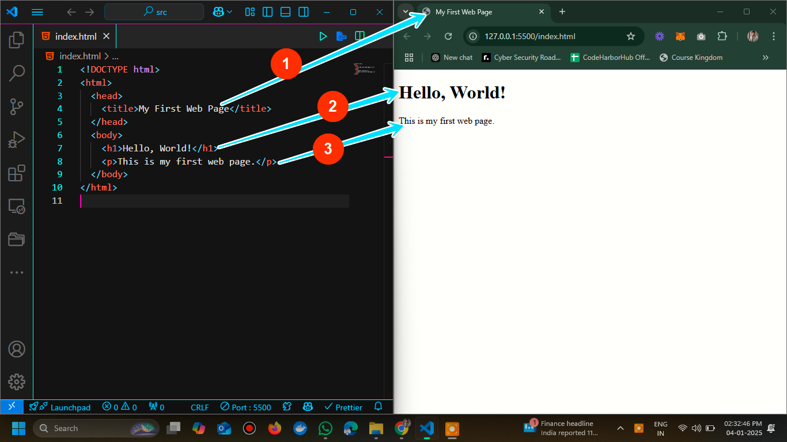

> *This is part of GitHub/Git Tutorials and a continuation of the previous post where we discussed what is gitHub. I hope you have a basic understanding of what is Github in general. Let’s get started with Git Cheat Sheet. Git Cheat Sheet. 50 Git commands | Git Tutorials*

I can create like teaching how to fork and clone and making changes. HTML, which stands for **HyperText Markup Language**, serves as the backbone of the World Wide Web. It is the standard language used to create web pages, providing the structure and content that browsers render for users to interact with. Understanding how HTML works with web browsers is fundamental for anyone diving into web development.

<AdsComponent />

## Understanding Git: The Building Blocks

HTML is a markup language that uses tags to define the structure and content of web pages. These tags are enclosed in angle brackets (`<` and `>`), and they tell the browser how to display the content. For example, the following HTML code snippet creates a simple web page with a heading and a paragraph:

<Tabs>
  <TabItem value="Git Code" label="Git Code">
  
  ```html title="Adding file to the repo"
   git add filename.ipynb
    ```

    </TabItem>
    
    <TabItem value="how-git-works" label="Output on browser">
      
    </TabItem>
</Tabs>

In this example, the `<h1>` tag creates a heading, and the `<p>` tag creates a paragraph. The browser interprets these tags and displays the content accordingly. HTML tags can be nested within each other to create more complex structures, such as lists, tables, forms, and more.


<AdsComponent />

## How Web Browsers Render HTML

When a user requests a web page by entering a URL in the browser's address bar or clicking a link, the browser sends a request to the web server hosting the page. The server responds by sending the HTML content of the page back to the browser. The browser then parses the HTML code and renders the page on the user's screen.

<Tabs>
  <TabItem value="Git Code" label="Git Code">
  
  ```html title="Commiting the changes"
  git commit -m "Give some meaningfull comments"
    ```

    </TabItem>
    
    <TabItem value="how-git-works" label="Output on browser">
      
    </TabItem>
</Tabs>

**Pushing Changes to the branch**

    :::info
<Tabs>
  <TabItem value="Git Code" label="Git Code">
  
  ```html title="Uploading file to the remote"
 git push origin [name_of_your_new_branch] -> Push the branch on github :
    ```

    </TabItem>
    
    <TabItem value="how-git-works" label="Output on browser">
      
    </TabItem>
</Tabs>
    :::

3. **Git Pull**: The browser paints the pixels on the screen according to the layout determined in the rendering step. It combines the content, styles, and layout to create the final visual representation of the web page.
:::info
<Tabs>
  <TabItem value="Git Code" label="Git Code">
  
  ```html title="Uploading file to the remote"
 git push origin [name_of_your_new_branch] -> Push the branch on github :
    ```

    </TabItem>
    
    <TabItem value="how-git-works" label="Output on browser">
      
    </TabItem>
</Tabs>
    :::
4. **Reflow and Repaint**: If the user interacts with the page, such as scrolling or resizing the window, the browser may need to reflow and repaint parts of the page to reflect the changes. Reflow involves recalculating the layout of the affected elements, while repaint involves updating the affected pixels on the screen.
:::info
<Tabs>
  <TabItem value="Git Code" label="Git Code">
  
  ```html title="Uploading file to the remote"
 git push origin [name_of_your_new_branch] -> Push the branch on github :
    ```

    </TabItem>
    
    <TabItem value="how-git-works" label="Output on browser">
      
    </TabItem>
</Tabs>
    :::
By understanding how web browsers render HTML content, web developers can optimize their code and design to create fast and responsive web pages. Techniques such as minimizing the use of inline styles, reducing the number of DOM elements, and optimizing images can help improve the performance of web pages and provide a better user experience.

<AdsComponent />

## Useful 50 Git Commands Cheatsheet

In addition to rendering HTML content, web browsers handle various resources associated with a web page, including:

- **CSS Stylesheets**: Browsers download and apply CSS stylesheets to control the presentation of HTML elements. Stylesheets can be linked externally using the `<link>` tag or embedded within the HTML document using the `<style>` tag.

    For example, the following HTML code snippet links an external CSS stylesheet to the web page:

    <Tabs>
      <TabItem value="HTML Code" label="HTML Code">
      
      ```html title="git configuration commands"
     git --version
      git config _\--global #for global level config_
      git config _#for project level config_
      git config --global user.name <"name">
      git config --global user.email <"email">
      git config --global core.editor <"editor">
      git config --global color.ui true
        ```

        </TabItem>
  

        <TabItem value="Output On Browser" label="Output On Browser">
          <BrowserWindow url="http://127.0.0.1:5500/index.html" bodyStyle={{fontFamily: "Arial, sans-serif", backgroundColor: "#f9f9f9"}}>
            <h1 style={{color: "#333"}}>Hello, World!</h1>
            <p style={{color: "#666"}}>This is my first web page.</p>
          </BrowserWindow>
        </TabItem>
    </Tabs>


**Git Basic Commands**

      :::info
<Tabs>
  <TabItem value="Git Code" label="Git Code">
  
  ```html title="Basic Commands"
git init _#Initialize a local Git repository_
git add . _#add all file in the current directory_
git add  _#Add a file to the staging area_
git add -A _#Add all new and changed files to the staging area_
git clone _#Create a local copy of a remote repository_
    ```

    </TabItem>
    
    <TabItem value="how-git-works" label="Output on browser">
      
    </TabItem>
</Tabs>
    :::

3. **Git commits**: The browser paints the pixels on the screen according to the layout determined in the rendering step. It combines the content, styles, and layout to create the final visual representation of the web page.
:::info
<Tabs>
  <TabItem value="Git Code" label="Git Code">
  
  ```html title="Git Commit Commands"
git commit #commit staged files
git commit -a #stage and commit all changes to tracked files
git commit -am "message" #stage and commit all files with a message
git commit --amend -m "message" #add additional info to last commit
    ```

    </TabItem>
    
    <TabItem value="how-git-works" label="Output on browser">
      
    </TabItem>
</Tabs>
    :::
4. **Checking logs and views**: If the user interacts with the page, such as scrolling or resizing the window, the browser may need to reflow and repaint parts of the page to reflect the changes. Reflow involves recalculating the layout of the affected elements, while repaint involves updating the affected pixels on the screen.
:::info
<Tabs>
  <TabItem value="Git Code" label="Git Code">
  
  ```html title="Checking logs and views"
git log #view changes
git log --summary #view changes detailed
git log --oneline #view changes breifly
git status git show
    ```

    </TabItem>
    
    <TabItem value="how-git-works" label="Output on browser">
      
    </TabItem>
</Tabs>
    :::


4. **Git Diff**: If the user interacts with the page, such as scrolling or resizing the window, the browser may need to reflow and repaint parts of the page to reflect the changes. Reflow involves recalculating the layout of the affected elements, while repaint involves updating the affected pixels on the screen.
:::info
<Tabs>
  <TabItem value="Git Code" label="Git Code">
  
  ```html title="Git diff"
git diff
git diff --color-words
git diff -staged
    ```

    </TabItem>
    
    <TabItem value="how-git-works" label="Output on browser">
      
    </TabItem>
</Tabs>
    :::


4. **to rename a file to directly stage**: If the user interacts with the page, such as scrolling or resizing the window, the browser may need to reflow and repaint parts of the page to reflect the changes. Reflow involves recalculating the layout of the affected elements, while repaint involves updating the affected pixels on the screen.
:::info
<Tabs>
  <TabItem value="Git Code" label="Git Code">
  
  ```html title="to rename a file to directly stage"
git mv <filename> <renamed Filename>
git rm <filename>
    ```

    </TabItem>
    
    <TabItem value="how-git-works" label="Output on browser">
      
    </TabItem>
</Tabs>
    :::


4. **Working with Git branch**: If the user interacts with the page, such as scrolling or resizing the window, the browser may need to reflow and repaint parts of the page to reflect the changes. Reflow involves recalculating the layout of the affected elements, while repaint involves updating the affected pixels on the screen.
:::info
<Tabs>
  <TabItem value="Git Code" label="Git branch">
  
  ```html title="Checking logs and views"
git branch #list branches
git branch <name> #create new branch
git branch -d \[branch name\] #delete branch
git checkout <branch name>  #Switch to a branch
git merge <branch name>   #Merge a branch into the active branch
git merge <source name>  <Target name> #Merge a branch into a target branch
    ```

    </TabItem>
    
    <TabItem value="how-git-works" label="Output on browser">
      
    </TabItem>
</Tabs>
    :::


4. **Undo Changes**: If the user interacts with the page, such as scrolling or resizing the window, the browser may need to reflow and repaint parts of the page to reflect the changes. Reflow involves recalculating the layout of the affected elements, while repaint involves updating the affected pixels on the screen.
:::info
<Tabs>
  <TabItem value="Git Code" label="Git Code">
  
  ```html title="Undo Changes"
git checkout --  #telling git to undo changes in working directory.
git checkout -- . #undo all changes in working directory
git reset HEAD <file> #to unstage the file in staging area
git revert <sha value> #to revert back to specfic commit
git clean -n #show the untracked file status
git clean -f #remove untracked files
    ```

    </TabItem>
    
    <TabItem value="how-git-works" label="Output on browser">
      
    </TabItem>
</Tabs>
    :::

4. **Adding Changes to remote**: If the user interacts with the page, such as scrolling or resizing the window, the browser may need to reflow and repaint parts of the page to reflect the changes. Reflow involves recalculating the layout of the affected elements, while repaint involves updating the affected pixels on the screen.
:::info
<Tabs>
  <TabItem value="Git Code" label="Git Code">
  
  ```html title="Adding Changes to remote"
git remote add origin <link URL>  #Add a remote repository
git branch -M main #make the branch main
git push -u origin main #Push changes to remote repository and remember the branch
    ```

    </TabItem>
    
    <TabItem value="how-git-works" label="Output on browser">
      
    </TabItem>
</Tabs>
    :::
By managing these resources efficiently, web developers can create engaging and interactive web pages that deliver a rich user experience. Understanding how HTML works with web browsers and how browsers render content is essential for building modern web applications that meet user expectations and performance standards.

<AdsComponent />


<AdsComponent />

## Conclusion

In conclusion, I hope you enjoyed reading this article on “Git Cheat Sheet. 50 Git commands |Git Tutorials”. In the next post, We will continue the Git/Github courses with more added materials and set up of git in your system. Signing off Sanjay Kv