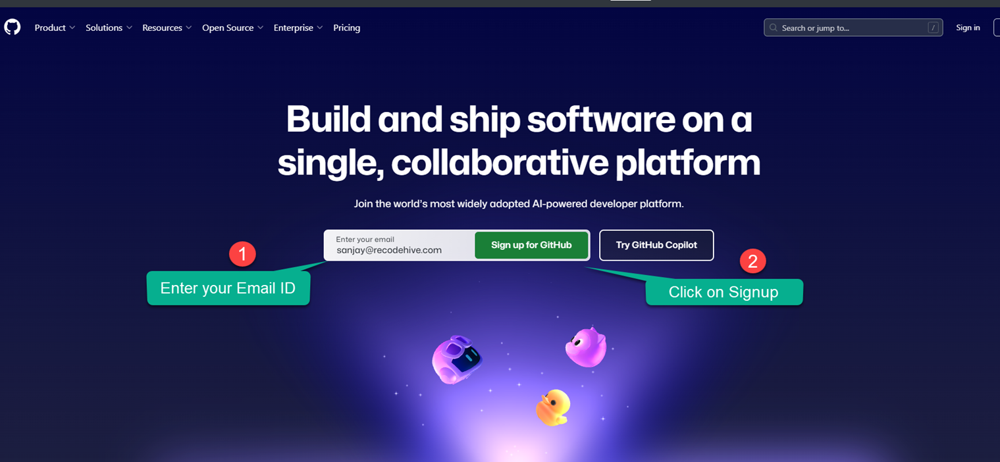
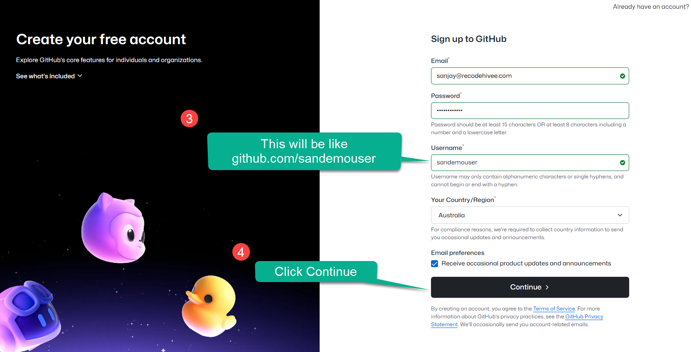
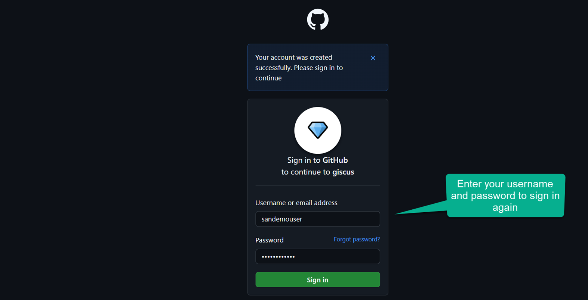
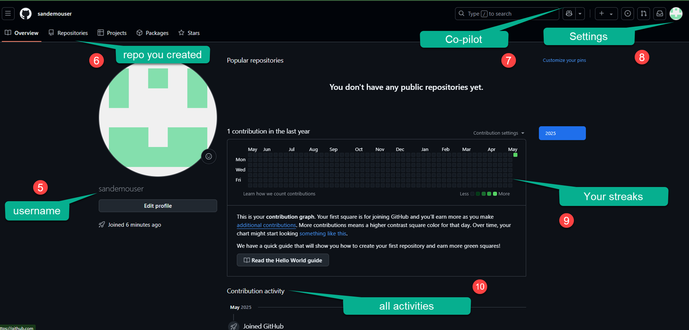

Github is a way of version control your software development using Git, Github was founded in 2008 and recently Microsoft has bought the company now Microsoft is the parent organization of Github. Now setting up is very straight forward process , first you need to create a GitHub account online, then Install Git in your system and connect your Git with GitHub. So all the changes will be updated to the GitHub. 

<AdsComponent />
### Step 1: Let’s create a Github Accountvbcvnb

1. Let’s create a Github Account, Go to the [GitHub Website](https://github.com/) and signup with your email ID.

    <BrowserWindow url="https://github.com/" bodyStyle={{padding: 0}}>    
     
    </BrowserWindow>

### Step 2: Finishing the account creation

1. Get your username:

   Firstly, make sure you opt for a readable username, this is very important just like your linkedin user name. Upon finishing the signup you will be getting a puzzle to solve which is part of the verification. 

     - **Live Server:** Signup screen of GitHub
    <BrowserWindow url="https://github.com/" bodyStyle={{padding: 0}}>    
     
    </BrowserWindow>
        

     - **What's you getting:** Upon finishing the signup you will be getting the Access to GitHub Copilot, access to unlimeted repository, built in tools to improve your code quality, automated workflows with actions, and support from community.
          
   
    <BrowserWindow url="https://github.com/signin" bodyStyle={{padding: 0}}>    
     
    </BrowserWindow>

   - 1. Upon sign in It will ask you to autorize Giscus (comment feature by GitHub) Click on Authorize ?
   - 2. Click on on the top right side ``profile icon`` -> ``your profile`` to see your profile.

<AdsComponent />

### Step 3: Understanding the Interface.

Next step, Github will ask you to verify the account. As a final step it will ask you to verify the account, all you need to go to the email dashboard and verify the mail ID to proceed further. After verification, you will be redirected to the Github page as shown below, can also see whether your account is verified or not as highlighted below. I would recommend skipping this step to proceed further.

    <BrowserWindow url="https://github.com/sanjay-kv" bodyStyle={{padding: 0}}>    
     
    </BrowserWindow>

   
### Step 5:  Final Step

This is how a newly created Github account looks like, we will learn how to create a repository and manage your profile in the upcoming posts. Let’s close this post by showing how a professional Github Account looks like.

Congratulations! 

1. ``5`` Shows the username unique to you.
2. ``6`` This is the place where all the projects and repository you will be creating.
3. ``7`` This is feature by GitHub AI, it helps you to chat-gpt simillar feature helping with your coding.
4. ``8`` you will find all the advanced settings over here, including changing your username, changing theme etc.
5. ``9`` Any acitivity you do on GitHub will be recorded here as green check box, come here on ``Halloween`` :p.
6. ``10`` Apart from the checkbox all the activity of a month will be available here, you have option to make it private.

<AdsComponent />

## Conclusion

In conclusion, I hope you enjoyed reading this article on “How to create Github Account?”. In the next post, will be discussing using Git to create a Repository and clone a project Github.  Signing off Sanjay Viswanathan.