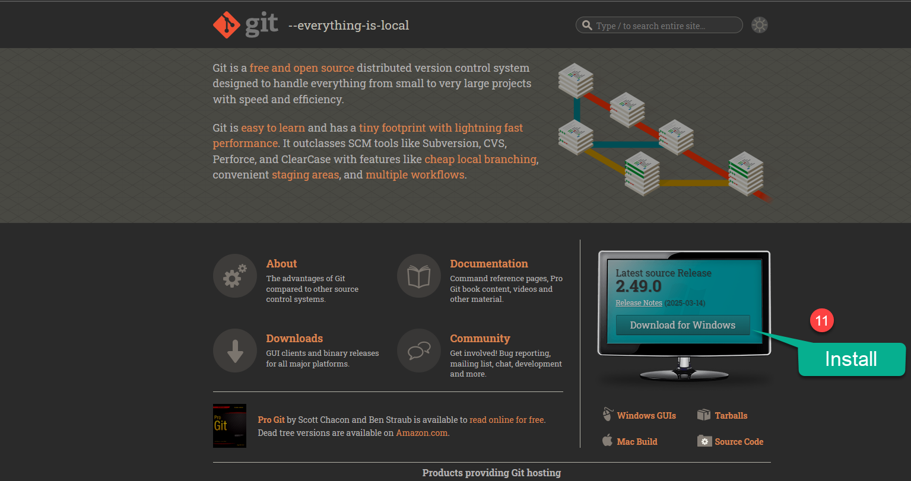
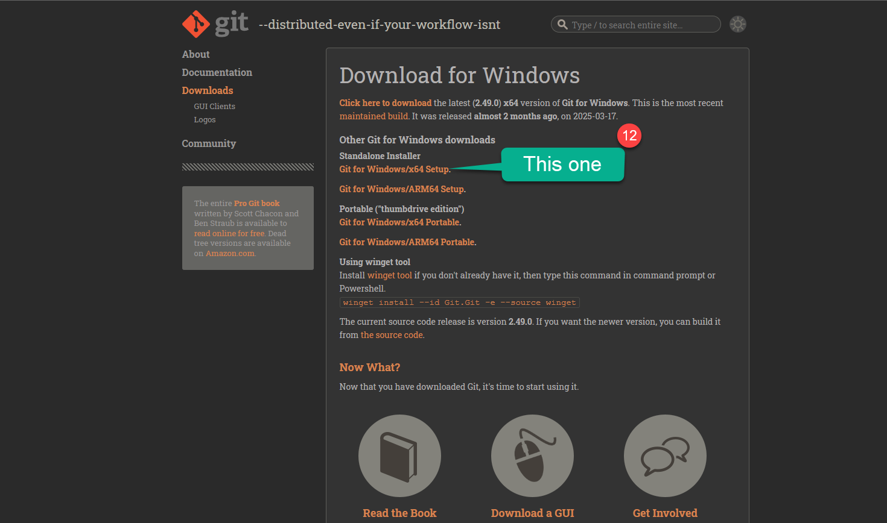
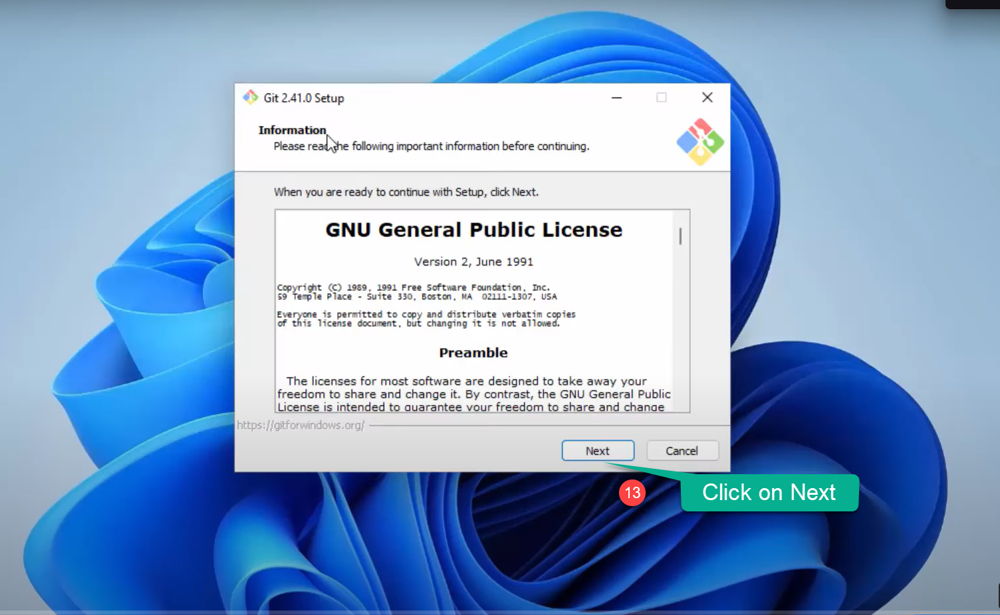
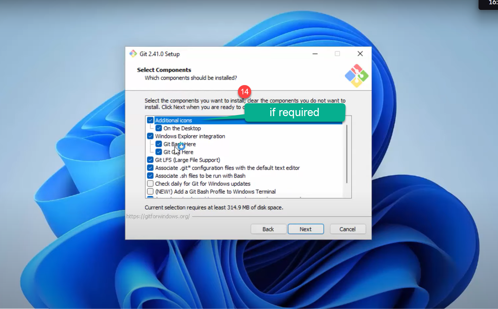
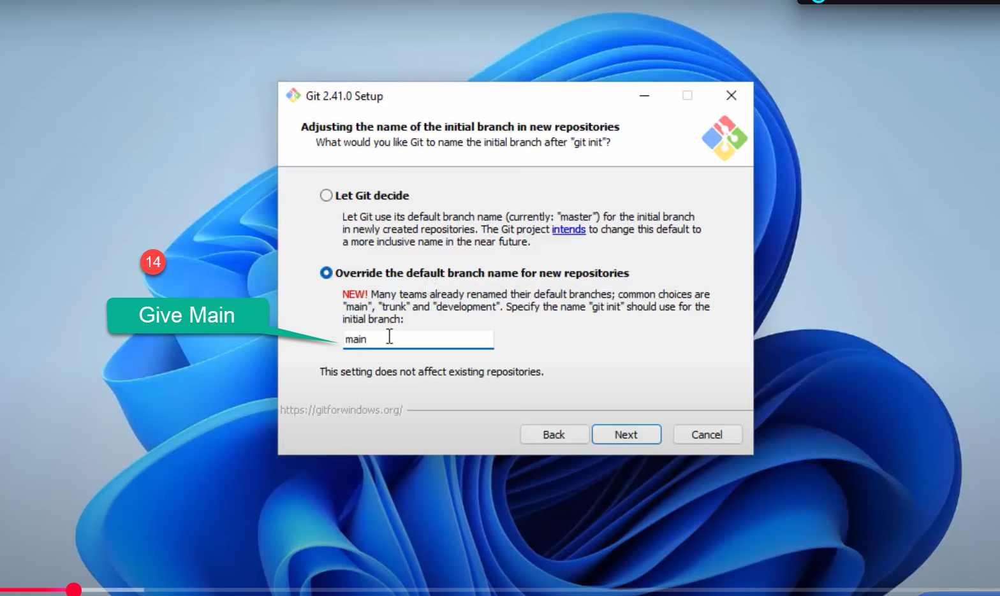
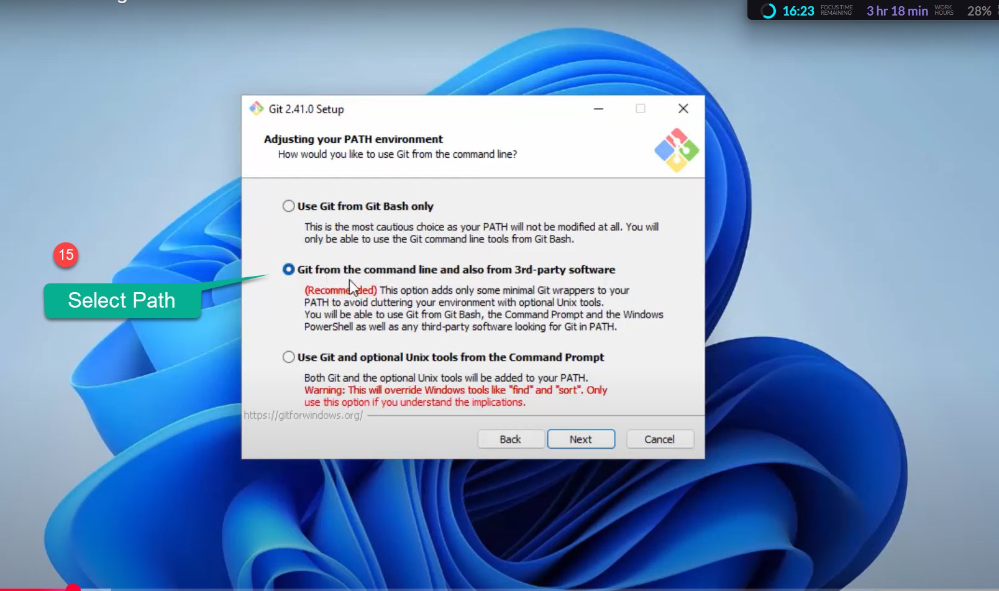
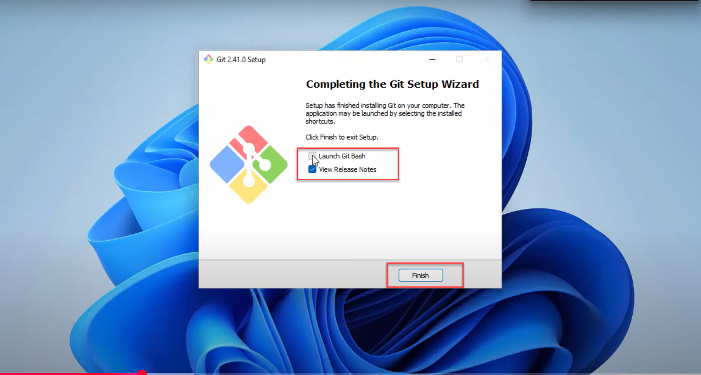

Github is a way of version control your software development using Git, Github was founded in 2008 and recently Microsoft has bought the company now Microsoft is the parent organization of Github. Now setting up is very straight forward process , first you need to create a GitHub account online, then Install Git in your system and connect your Git with GitHub. So all the changes will be updated to the GitHub. 

<AdsComponent />
### Step 1: Let’s Download the git 

1. Go to the [Git Website](https://git-scm.com/) and click on download for windows button.

    <BrowserWindow url="https://git-scm.com/" bodyStyle={{padding: 0}}>    
     [](https://git-scm.com/)
    </BrowserWindow>


### Step 2: Select your Version you want to insatll.

1. Get your Installer:

   Based on the current version of windows you can choose to have standalone installer or windows insaller to get started with. As my system is 64 bit i will choose here 64 bit, you can get know which system you are using by going to ``This PC`` icon right click on ``Properties`` Check under the system type. 

     - **Installer:** Get the Installer
    <BrowserWindow url="https://git-scm.com/downloads/win" bodyStyle={{padding: 0}}>    
     [](https://git-scm.com/downloads/win)
    </BrowserWindow>
        

     - **Start Installation:** Open the Installer, upon downloading. 
          
   
    <BrowserWindow url="https://git-scm.com/" bodyStyle={{padding: 0}}>    
     [](https://git-scm.com/)
    </BrowserWindow>

   - 1. The next screen click next on Public Licence.
   - 2. Choose the location as default and click on Next

<AdsComponent />

### Step 3: Understanding the Interface.

Next step, Git Will ask you to install couple of components you can checko on additional icons to add on Desktop and leave the rest as default and click on the Next.

   - 1. The next screen click next , make sure the start folder name is Git.
   - 2. Next option is to choose the default editor  you can use your editor, im using visual studio code. or keep Vim as the default editor


    <BrowserWindow url="https://git-scm.com/" bodyStyle={{padding: 0}}>    
     [](https://github.com/sanjay-kv)
    </BrowserWindow>

   
### Step 5:  Adjusting name of the repo setting in Git

This stage it will ask you to Choose a initial branch in new repository, it would be ideal approach to give the second option, as we move further it gives us flexibility to change the intial branch name , like main master, trunk. 


     <BrowserWindow url="https://git-scm.com/" bodyStyle={{padding: 0}}>    
     [](https://github.com/sanjay-kv)
    </BrowserWindow>

   
### Step 5:  Adjusting Your path enviornment

This is where we specify the path enviornment of git, just go with the recommened option which is 2.

     <BrowserWindow url="https://git-scm.com/" bodyStyle={{padding: 0}}>    
     [](https://github.com/sanjay-kv)
    </BrowserWindow>


1. ``1`` In the next screen choose the SSH Executable, use the deafault one ``use bundled OpenSSH`` which is the default option.
2. ``2`` On the next, you will ask to configuring the line ending conversions, you gotta keep it default which is option 1.
3. ``3`` Next step will be configuring the terminal emulator to use the git bash. Keep the default which is option 1.
4. ``4`` Next option is to choose the defualt option to use the gith . use the default one which is the Fast- forward and merge option 1.
5. ``5`` In the Credential helper choose the ``Git Credential Manager`` screen. and click on Next.
6. ``6`` Enable the extra option , click on the ``Enable the file system Caching`` and click on the Next button. 
7.  ``7`` In the Next step Screen it will ask you to enable the expiremental support , choose the both the option and click on Install. 

     <BrowserWindow url="https://git-scm.com/" bodyStyle={{padding: 0}}>    
     [](https://github.com/sanjay-kv)
    </BrowserWindow>

Congratulations! The Git Setup has been finished and now you can launch the GitHub.

After that setup, you can see in your PC’s application list there are few new apps are added like ‘Git Bash,’ ‘Git GUI,’ ‘Git CMD.’ However, we will mostly use Git Bash for uploading our projects.

Execute the below command to see your current version of git in Git CMD or windows command promt. Git Installation on Windows is completed.
  ```html title="create a new repository on the command line"
git --version
    ```
<AdsComponent />

## Conclusion

In conclusion, I hope you enjoyed reading this article on “Setting up your Git Enviornment?”. In the next post, will be discussing using Git to create a Repository and clone a project Github.  Signing off Sanjay Viswanathan.