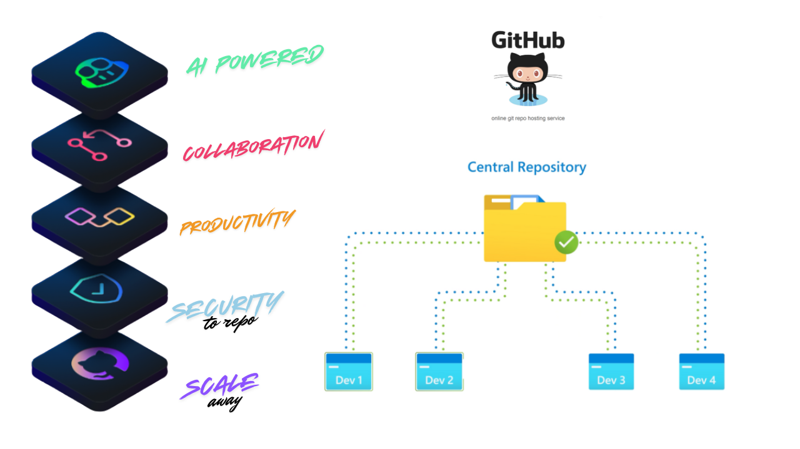

GitHub is a web-based platform used for version control and collaboration. It allows developers to work together on projects from anywhere in the world. GitHub is built on top of Git, a distributed version control system created by Linus Torvalds in 2005.
< />

:::note
Key Features of SQL:
GitHub  will help you to control the version of the project on a large scale.

GitHub offers <a href="https://github.com/pricing">Premium</a> account for use, Premium users get unlimited Github Repo time, Storage etc. 

:::

## How to start with GitHub?

Whenever you create something exciting or something new on your own, you always want to show it to others. As programmers, we also want to show our projects and codes to others, but how? So GitHub is the solution, it let's people to collaborate and scale the projects all on cloud.  Some other example of simillar platform are , Bitbucket, GitLab, Beanstalk, etc. Many of them give you the facility to work on your code together as a team. Currently, Github is more popular than other above-listed platforms for hosting your code.
:::info
In the picture below you could see Developer 1, Developer 2... are working on the same project , lets say they are trying to build a amazon website, developer 1 handles the Mens shopping section, Developer 2 deals with Womens section, Developer 3 works on the login feature. 

So each indivituals works on different feature from the copy of the central repository, once the development is done they push changes to the **remote repository** (central repo as per picture). Once **code review** happens and good to go, the senior developer will merge the code to the central repository so all the feature will be live on production.
:::

  <BrowserWindow url="https://github.com/" bodyStyle={{padding: 0}}>    
     
    </BrowserWindow>

## What is Git??

So in the above example all the developer where able to work on different feautre simulatneaulsy because of the git. For uploading your project to your Github account, you need to install Git first. In other words, Git helps to do this version management of the files and coordinating work among the diverse team in the software development phase. Git is an open-source project and developed in 2005 by Linus Torvalds and Junior.

  
:::info
1.  **What is Version control System?**: To understand the version control system, let me give you one example; sometimes, you wish you have a record that contains all the changes you made in your code or your project. The version control systems are software tools that record all of your changes in the files. It is like a database of changes. Git is a version control system that most developers prefer to use. We will see how you can upload your code on Github using Git. With VCS you can track the branch, who made changes at what time, line of code added, retrive the previous version of changes. 
2.  Basic Git Terminology::

        | Keyword | 	Terminology | 	Description |
        | --- | --------------- | -------------------- |
        | VCS   | Version Control System | Track changes to a collection of files |
        | SCM  | Software configuration Management | 	Another name for VCS, the earlier version of VCS like CVS, SVN used to be centralised server, which cause single point of failure. |
        | DVCS | 	Distributed Version Control System| Git is distributed, the project history is stored both in client and server. Means you can make changes locally and remote. |
        | Working Tree  | Tree | Current version of files where the active project is on |
        | Repo  | 	Repository | 		Top of working Tree where git keep all records and history. |
        | Bare repo   | 	 | 		Not part of working Tree ends with .git, eg. backup.git |
        | Hash  | 	160 bit long SHA-1 | 		Based on the hash number, the file has been modified or not. |
        | Object  | 	Git have 4 objects | 		Tree Object(directory, names),  Blob Object(main file), Commit Object(spesfic versions), Tag(name attached to commit) |
        | Commit  |  | 		Makes Changes |
        | Branch  | 	a series of Linked commit | 		The recent commit is called Head. |
        | Remote  | 	 | 		reference to other git repo |
        | | 	 Git Command | 		Check this tutorial

:::

## Why Learn GitHub? 

GitHub Simplfy all the command line interface of Git and make it more GUI friendly. GitHub has builds above of git. Here want we do is staging the files and doing the commit, You can clone the entire repository and create a branch and commit to that branch ask the main developer to merge the branch. when you clone in reality you are creating a copy of the real code/repository in your local environment.

 []
   
  
:::info
1.  Basic GitHub Keywords::

        | Category | 	Description |
        | --- |  -------------------- |
        | Issues | Retrieve data from tables |
        | Discussions |  |
        | Pull requests |  |
        | Notifications |  |
        | Labels |  |
        | Actions |  |
        | Forks |  |
        | Projects |  |

The fork is a personal copy of the repo which is already present or uploaded in GitHub by a different user. Once you fork and make changes to the repository the changes will happen to your forked repo, not the real one.

:::

< />

### Watch the video Tutorial
<iframe width="853" height="480" src="https://www.youtube.com/embed/GrTV59Y84S8?list=PLrLTYhoDFx-kiuFiGQqVpYYZ56pIhUW63" title="How to start with GitHub in 2024 | Beginner&#39;s Guide" frameborder="0" allow="accelerometer; autoplay; clipboard-write; encrypted-media; gyroscope; picture-in-picture; web-share" referrerpolicy="strict-origin-when-cross-origin" allowfullscreen></iframe>

< />

## Conclusion

If you think this Github Tutorial starter kit for Beginner was useful to you, then don’t forget to share it with others.  Till then, we will meet For uploading your project to your Github account, you need to install Git first. which we will discuss in detail in the next post.
