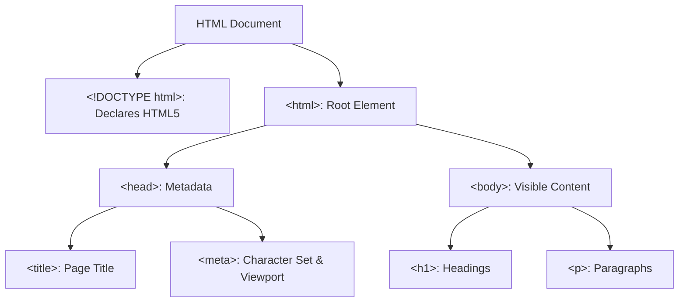

HTML (Hypertext Markup Language) is the standard markup language for creating web pages. It provides the structure and layout of the content on the web. In this tutorial, you will learn about the syntax and structure of HTML.

<AdsComponent />

## HTML Syntax

HTML syntax refers to the rules for arranging elements and attributes to create well-formed HTML documents. The basic building blocks of HTML syntax include elements, tags, and attributes.

```html title="index.html"
<!DOCTYPE html>
<html lang="en">
  <head>
    <meta charset="UTF-8" />
    <meta name="viewport" content="width=device-width, initial-scale=1.0" />
    <title>My First Page</title>
  </head>
  <body>
    <!-- Your content goes here -->
  </body>
</html>
```

### Explanation and Visual Representation

In the above code snippet of an HTML document, the following elements are used like:

<div style={{border: "1px solid #ccc", padding: "1rem", marginBottom: "1rem"}}>

&lt;!DOCTYPE html&gt;

&lt;html&gt;

  <div style={{border: "1px solid #ccc", padding: "1rem", margin: "0.5rem", marginBottom: "0.5rem"}}>
    
    &lt;head&gt;

    <div style={{border: "1px solid #ccc", padding: "1rem", margin: "0.5rem", marginBottom: "1rem"}}>

      &lt;meta charset="UTF-8" /&gt;

      &lt;meta name="viewport" content="width=device-width, initial-scale=1.0" /&gt;

      &lt;title&gt;My First Page&lt;/title&gt;

    </div>

  &lt;/head&gt;

  &lt;body&gt;

  <div style={{border: "1px solid #ccc", padding: "1rem", margin: "0.5rem", marginBottom: "0.5rem"}}>
    
    &lt;!-- Your content goes here --&gt;

    </div>

  &lt;/body&gt;

  </div>

  &lt;/html&gt;
</div>

<br />

Now, let's understand the elements used in the HTML document:

- **`<!DOCTYPE html>`**: Declares the document type and version of HTML.
- **`<html>`**: Root element that contains all other elements.
- **`<head>`**: Contains metadata about the document. It includes elements like `<meta>` and `<title>`.
- **`<meta charset="UTF-8" />`**: Specifies the character encoding of the document.
- **`<meta name="viewport" content="width=device-width, initial-scale=1.0" />`**: Sets the viewport properties for responsive design.
- **`<title>`**: Sets the title of the document (displayed in the browser tab).
- **`<body>`**: Contains the visible content of the document.
- **`<!-- Your content goes here -->`**: Represents a comment that is not displayed in the browser.

<AdsComponent />

## HTML Document Structure

An HTML document consists of the following basic structure:

```html title="index.html"
<!DOCTYPE html>
<html lang="en">
  <head>
    <meta charset="UTF-8" />
    <meta name="viewport" content="width=device-width, initial-scale=1.0" />
    <title>My First Page</title>
  </head>
  <body>
    <h1>Hello, World!</h1>
    <p>Welcome to HTML learning.</p>
  </body>
</html>
```

### Visual Representation

Below is a visual representation of the basic HTML document structure:



### Browser Rendering

When the above HTML code is rendered in a browser, it will display the following content:

<BrowserWindow url="http://127.0.0.1:5500/index.html">
  <>
    <h1>Hello, World!</h1>
    <p>Welcome to HTML learning.</p>
  </>
</BrowserWindow>

### Explanation

- **`<!DOCTYPE html>`**: Declares the document type and version of HTML.
- **`<html>`**: Root element that contains all other elements.
- **`<head>`**: Contains metadata about the document.
- **`<title>`**: Sets the title of the document (displayed in the browser tab).
- **`<meta>`**: Provides character set and viewport information.
- **`<body>`**: Contains the visible content of the document.
- **`<h1>`**: Heading element with the text "Hello, World!".
- **`<p>`**: Paragraph element with the text "Welcome to HTML learning.".

## Conclusion

In this tutorial, you learned about the syntax and structure of HTML. HTML syntax consists of elements, tags, and attributes that define the structure and content of a web page. An HTML document follows a basic structure with elements like `<!DOCTYPE html>`, `<html>`, `<head>`, `<title>`, `<meta>`, and `<body>`. Understanding HTML syntax and structure is essential for creating web pages and applications.
