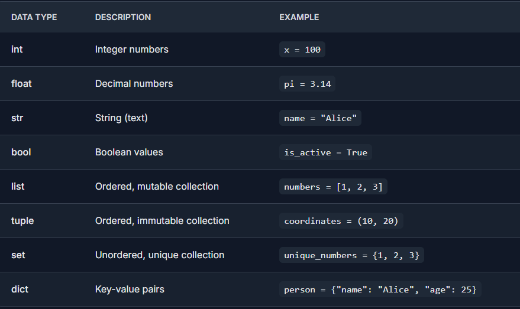

# Python Variables

In Python, variables are used to store data that can be referenced and manipulated during program execution. A variable is essentially a name that is assigned to a value. Unlike many other programming languages, Python variables do not require explicit declaration of type. The type of the variable is inferred based on the value assigned.

Variables act as placeholders for data. They allow us to store and reuse values in our program.


### 1. What is a Variable?

A variable is like a container for storing data values. You don’t need to declare its type explicitly — Python handles it dynamically.

```python
x = 5
y = "Hello"
````

Here:

* `x` is of type `int`
* `y` is of type `str`


### 2. How to Declare and Assign Variables

You simply write a variable name, use the `=` sign, and assign a value.

```python
a = 10
name = "GeeksForGeeks"
price = 99.99
is_active = True
```

Python automatically understands the type of variable.


### 3. Multiple Assignments in One Line

Python allows assigning values to multiple variables in a single line.

```python
x, y, z = 1, 2, 3
```

You can also assign the **same value to multiple variables**:

```python
a = b = c = 100
```


### 4. Variable Naming Rules

* Must start with a letter (a–z, A–Z) or an underscore (\_)
* Can contain letters, digits, and underscores
* Are case-sensitive (`name` and `Name` are different)
* Cannot use reserved keywords like `if`, `class`, `def`, etc.

```python
# Valid
my_var = 1
_var = 2
var3 = 3

# Invalid
3var = 10       # starts with digit
my-var = 20     # hyphen not allowed
def = 30        # 'def' is a keyword
```


### 5. Standard Data Types in Python

Python variables can hold different types of data:


  

### 6. Type Checking with `type()`

```python
x = 10
print(type(x))   # <class 'int'>
```


### 7. Changing Variable Type Dynamically

Python allows dynamic typing:

```python
x = 5
print(type(x))  # <class 'int'>

x = "Hello"
print(type(x))  # <class 'str'>
```


### 8. Deleting a Variable with `del`

You can remove a variable from memory using `del`.

```python
x = 100
del x

print(x)  # Raises NameError
```


### 9. Scope of Variables

There are **two types of variable scope**:

### 10. Global Variable

Declared outside functions, accessible anywhere.

```python
x = "global"

def show():
    print(x)

show()  # Output: global
```

### 11. Local Variable

Declared inside functions and accessible only inside them.

```python
def greet():
    msg = "Hello"
    print(msg)

greet()
print(msg)  # Error: NameError
```


### 🟢 The `global` Keyword

Use `global` to modify global variables inside a function.

```python
x = 10

def update():
    global x
    x = 20

update()
print(x)  # Output: 20
```


### 12. Memory Management in Python

* Python variables are **names** bound to **objects in memory**.
* Use `id()` to get the memory address (or reference ID) of a variable.

```python
x = 5
print(id(x))
```

If two variables have the same immutable value, they may share the same memory.

```python
a = 100
b = 100
print(id(a) == id(b))  # True
```


### 🟢 Example Program

```python
# Python Variable Example

name = "Dhruba"
age = 22
price = 49.99
is_valid = True
items = ["pen", "notebook"]

print("Name:", name)
print("Age:", age)
print("Price:", price)
print("Valid:", is_valid)
print("Items:", items)
```

**Output:**

```
Name: Dhruba
Age: 22
Price: 49.99
Valid: True
Items: ['pen', 'notebook']
```


## Summary

* Python variables store different types of data without explicit declaration.
* Variables are case-sensitive and follow naming rules.
* Scope determines where a variable is accessible.
* `global` and `del` are important keywords for variable handling.
* Python handles memory management internally but allows inspection via `id()`.


### Highlights

* Covers both global and local variables
* Explains `del`, `global`, and `id()` functions
* Includes formatted tables and output blocks
* Beginner-friendly explanation with examples