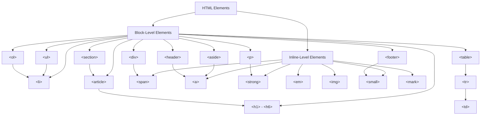

HTML elements and tags are the building blocks of HTML pages. Elements define the structure and content of the web page, while tags are used to mark up the elements. In this tutorial, you will learn about HTML elements and tags and how they are used to create web pages.

<AdsComponent />

## HTML Elements

HTML elements are the basic building blocks of an HTML page. They define the structure and content of the web page and are enclosed in opening and closing tags. Each element can contain text, other elements, or both.

Here is an example of an HTML element:

```html title="index.html"
<p>This is a paragraph element.</p>
```

In this example, the `<p>` element defines a paragraph, and the text "This is a paragraph element." is the content of the paragraph.

HTML elements can be nested inside each other to create a hierarchical structure. For example:

```html title="index.html"
<div>
  <h1>This is a heading</h1>
  <p>This is a paragraph.</p>
</div>
```

In this example, the `<div>` element contains an `<h1>` heading element and a `<p>` paragraph element.

<AdsComponent />

:::tip
### Visual Representation of HTML Elements

The following diagram illustrates the relationship between different types of HTML elements:



:::

## HTML Tags

HTML tags are used to mark up HTML elements. Tags are enclosed in angle brackets (`<` and `>`) and come in pairs: an opening tag and a closing tag. The opening tag marks the beginning of an element, and the closing tag marks the end of the element.

Here is an example of an opening and closing tag:

```html title="index.html"
<p>This is a paragraph element.</p>
```

In this example, the `<p>` tag is the opening tag, and the `</p>` tag is the closing tag. The content of the paragraph is enclosed between the opening and closing tags.

Some HTML elements are self-closing and do not require a closing tag. These elements are written as a single tag with a forward slash before the closing angle bracket. For example:

```html title="index.html"

```

In this example, the `` tag is a self-closing tag that displays an image on the web page.

<AdsComponent />

## Common HTML Elements and Tags

Here are some common HTML elements and tags that are frequently used in web development:

| Tag          | Description                                | Example Usage          |
|--------------|--------------------------------------------|------------------------|
| `<div>`      | Defines a division or section              | `<div>...</div>`       |
| `<p>`        | Defines a paragraph                        | `<p>...</p>`           |
| `<h1> - <h6>`| Defines headings of different levels       | `<h1>...</h1>`         |
| `<a>`        | Defines a hyperlink                        | `<a href="url">...</a>`|
| ``      | Defines an image                           | `` |
| `<ul>`       | Defines an unordered list                  | `<ul><li>...</li></ul>`|
| `<ol>`       | Defines an ordered list                    | `<ol><li>...</li></ol>`|
| `<li>`       | Defines a list item                        | `<li>...</li>`         |
| `<table>`    | Defines a table                            | `<table>...</table>`   |
| `<tr>`       | Defines a table row                        | `<tr>...</tr>`         |
| `<td>`       | Defines a table cell                       | `<td>...</td>`         |
| `<span>`     | Defines a section in a document            | `<span>...</span>`     |
| `<strong>`   | Defines important text                     | `<strong>...</strong>` |
| `<em>`       | Defines emphasized text                    | `<em>...</em>`         |

These are just a few examples of the many HTML elements and tags available for creating web pages. By using these elements and tags effectively, you can structure and format the content of your web pages.

## Conclusion

HTML elements and tags are essential for creating web pages. Elements define the structure and content of the page, while tags are used to mark up the elements. By understanding how elements and tags work, you can create well-structured and readable HTML documents.