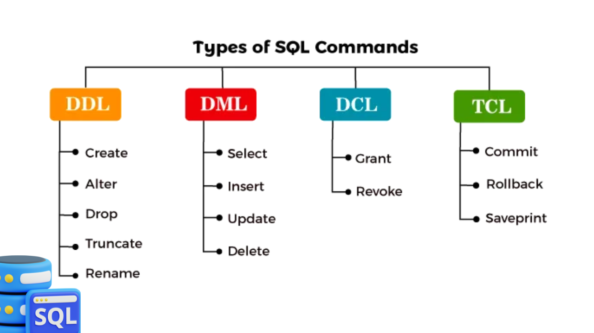

##
SQL **Structured Query Language** is a standard programming language used to manage and manipulate relational databases. It allows users to store, retrieve, update, and delete data in a structured format. SQL became a standard of the American National Standards Institute (ANSI) in 1986 and of the International Organization for Standardization (ISO) in 1987. 


:::note
Key Features of SQL:
Data Querying: Retrieve data from one or more tables using commands like **SELECT**.

DML (Data Manupulation Language): Add, update, or delete records using **INSERT**, **UPDATE**, and **DELETE**.

DDL (Data Definition Language): Define database structures using **CREATE**, **ALTER**, and **DROP**.

DCL ( Data Control Language): Control access and permissions with **GRANT** and **REVOKE**.

TCL (Transactional Control Language): Involves **COMMIT** and **ROLLBACK**.
:::

    <BrowserWindow url="https://github.com" bodyStyle={{padding: 0}}>    
     [](https://github.com/sanjay-kv)
    </BrowserWindow>


:::success
Let's talk about history of Storing Data, It's started with physical files and shelf. Then later on company started using Excel or Access. There is limitation for these tools when comes to high data volume. 

Then company started developing database management system like SQL, Postgres,MySQL.

> Databases are two types, SQL(Relational, Analytical OLAP) and NOSQL(key value, Graph, Document) mainly used for un-structured dataset. This NoSQL provides more flexibility over Relational as it dont have to follow schemas.

> Schema is named collection of tables, which can contains, views, index, datatypes, operators and functions.
:::

:::info 

| **#** | **Keyword/Concept**                              | **Description**                                                                 |
|-------|--------------------------------------------------|---------------------------------------------------------------------------------|
| 1     | `SELECT`                                         | Retrieves data from one or more tables in a database.                          |
| 2     | `FROM`                                           | Specifies the table or tables to retrieve data from.                           |
| 3     | `WHERE`                                          | Filters rows based on specific conditions.                                     |
| 4     | `JOIN`                                           | Combines rows from two or more tables based on a related column.              |
| 5     | `GROUP BY`                                       | Groups rows that have the same values into summary rows.                      |
| 6     | `ORDER BY`                                       | Sorts the result-set by one or more columns.                                   |
| 7     | `HAVING`                                         | Filters data after grouping using `GROUP BY`.                                  |
| 8     | `INSERT`                                         | Adds new records to a table.                                                  |
| 9     | `UPDATE`                                         | Modifies existing records in a table.                                         |
| 10    | `DELETE`                                         | Removes records from a table.                                                 |
| 11    | `CREATE`                                         | Creates a new database object (table, view, etc.).                            |
| 12    | `ALTER`                                          | Modifies an existing database object.                                         |
| 13    | `DROP`                                           | Deletes a database object.                                                    |
| 14    | Aggregation Functions (`MIN`, `MAX`, `AVG`, `COUNT`) | Performs calculations on a set of values and returns a single value.     |
| 15    | Joins (`INNER`, `LEFT`, `FULL`)                  | Retrieves data from multiple tables with matching or non-matching values.      |
| 16    | `CASE` Statement                                  | Adds conditional logic within SQL queries.                                    |
| 17    | Window Functions (`RANK`, `DENSE_RANK`, `ROW_NUMBER`) | Performs calculations across a set of table rows related to the current row. |


1.  **Structure and Content**: In SQL, the structure refers to how data is organized in tables, and the content refers to the actual data stored within those tables.


| **Category**  | **Alias** | **Description** |
|---------------|-----------|-----------------|
| Tuple         | Row       | Record          |
| Attribute     | Col       | Field           |


    **For example, the following SAQl code creates a table named students**

    <Tabs>
      <TabItem value="Basic SQL">
       ```sql
       -- Create a table
        CREATE TABLE Students (
        ID INT,
        Name VARCHAR(50),
        Age INT
        );

      -- Insert a record
        INSERT INTO Students VALUES (1, 'Alice', 22);

      -- Query the table
        SELECT * FROM Students;

      -- Update a record
        UPDATE Students SET Age = 23 WHERE ID = 1;

      -- Delete a record
        DELETE FROM Students WHERE ID = 1;
       ```
       </TabItem>
       <TabItem value="Output">
       ```plaintext
       -- After creating the table and inserting a record:
       ID   Name    Age
       1    Alice   22

       -- After updating the record:
       ID   Name    Age
       1    Alice   23

       -- After deleting the record:
       (No rows returned)
       ```
       </TabItem>
      <TabItem value="DDL">
       ```sql
       -- CREATE TABLE statement to create a new table with columns and data types
       CREATE TABLE customers (
       id INT PRIMARY KEY,
       name VARCHAR(50),
       email VARCHAR(50));
       
       -- ALTER TABLE statement to add a new column to an existing table
       ALTER TABLE customers ADD COLUMN phone VARCHAR(20);
       
       -- DROP TABLE statement to remove a table from the database
       DROP TABLE customers;
       ```
       </TabItem>
      <TabItem value="DML">
       ```sql
       -- INSERT statement to add new data to a table
       INSERT INTO customers (name, email) VALUES ('John Doe', 'johndoe@email.com');
       
       -- UPDATE statement to modify existing data in a table
       UPDATE customers SET email = 'new@email.com' WHERE name = 'John Doe';
       
       -- DELETE statement to remove data from a table
       DELETE FROM customers WHERE name = 'John Doe';
       ```
       </TabItem>
      <TabItem value="DCL">
       ```sql
       -- CREATE USER statement to create a new user account with specific permissions
       
       CREATE USER 'new_user' IDENTIFIED BY 'password';
       GRANT SELECT, INSERT, UPDATE ON customers TO new_user;
       ```
       </TabItem>
       <TabItem value="TCL">
       ```sql
       -- BEGIN TRANSACTION statement to start a new transaction
       BEGIN TRANSACTION;
       
       -- COMMIT statement to save changes made during a transaction
       COMMIT;
       
       -- ROLLBACK statement to undo changes made during a transaction
       ROLLBACK;
       ```
       </TabItem>
    </Tabs>


1.  Advantages: **Platform Independent?**: Yes and No — It Depends. The core SQL language (based on ANSI/ISO standards) is platform-independent, meaning the basic syntax and concepts—like SELECT, INSERT, UPDATE, and DELETE—are the same across different database systems. ❌ But, SQL Implementations Are Not Fully Platform Independent:
   
Different Database Management Systems (DBMS)—like MySQL, PostgreSQL, Oracle, SQL Server, and SQLite—extend SQL differently. They may:

- Use different data types (VARCHAR vs TEXT, etc.)
- Have custom functions and features
- Handle stored procedures, triggers, and syntax differently
- Offer different tools and performance optimizations
- So, SQL code written for one system may not work exactly the same on another without adjustments.

:::


# 🗃️ Why Learn SQL?

**SQL (Structured Query Language)** is the standard language used to manage and query **relational databases** — the most common way data is stored across businesses.  Whether it's **MySQL**, **PostgreSQL**, **SQL Server**, or **SQLite** — they all speak SQL! 💬

Data engineering is the process of collecting, transforming, and storing data in a way that allows for easy analysis and access. SQL is a critical tool in this process because it allows data engineers to:

1. ✅Retrieve data: SQL enables data engineers to retrieve specific data from a database by querying it based on certain criteria. This helps to ensure that data is accessible and easy to find.
2. ✅Manipulate data: SQL also enables data engineers to manipulate data within a database by adding, deleting, or updating data. This helps to ensure that data is accurate and up-to-date.
3. ✅Manage data: SQL enables data engineers to manage databases by creating tables, defining relationships between tables, and setting up security permissions. This helps to ensure that data is organized and secure.
   
---

## 📊 SQL: A Must-Have for Data-Driven Roles

SQL is a **critical skill** for anyone working with data. It empowers you to extract, analyze, and transform information efficiently.

Here are some roles where SQL is a game-changer:

👨‍💻 **Data Analysts**  
🛠️ **Data Engineers**  
🔬 **Data Scientists**  
📈 **Business Intelligence Professionals**  
💻 **Software Developers**  
📣 **Marketers**  
📦 **Product Managers**  
📊 **Business Analysts**

From running ad-hoc queries to building pipelines and dashboards — SQL is everywhere in data work! 🚀

---

### Steps to start using SQL

**1. Set up your development environment**: Go to MySQL Downloads Page:
    - Visit MySQL Workbench Downloads.

**2. Download the Installer:**: To create your first SQL commands, follow these steps:

    - Select the version compatible with your operating system (Windows, macOS, or Linux).
    - Click Download and follow the installation instructions.
    - https://dev.mysql.com/downloads/workbench/


## Conclusion

Learning SQL empowers you to talk to data, unlock insights, and build data-driven solutions—making it one of the most valuable and versatile skills in the digital world.

<GiscusComments/>